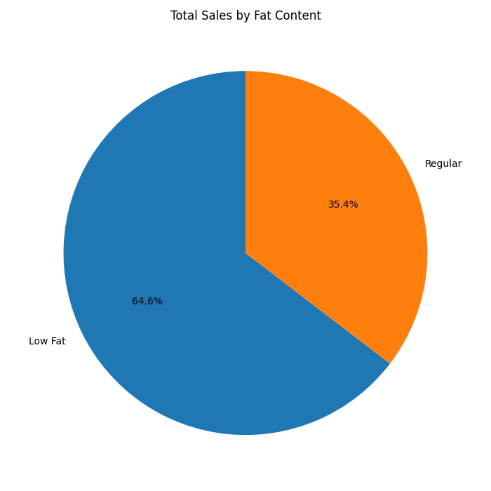

# Retail Sales Analysis

## Project Overview

This project analyzes retail sales data using Python.

The goal was to clean raw sales data, calculate key business metrics, and visualize sales distribution across product categories.

---

## Tasks Performed

- Cleaned inconsistent categorical data
- Standardized product labels
- Calculated key sales KPIs
- Performed exploratory data analysis
- Created sales visualizations using Matplotlib

---

## Key Metrics

The analysis included:

- Total sales
- Average sales
- Number of items sold
- Average customer rating

---

## Visualization

| Chart | Description |
|---|---|
|  | Sales distribution by fat content category |

---

## Key Insights

- Product categories contributed differently to total sales
- Raw retail data required cleaning before analysis
- KPI analysis provided a summary of overall sales performance

---

## Tools Used

- Python
- Pandas
- Matplotlib